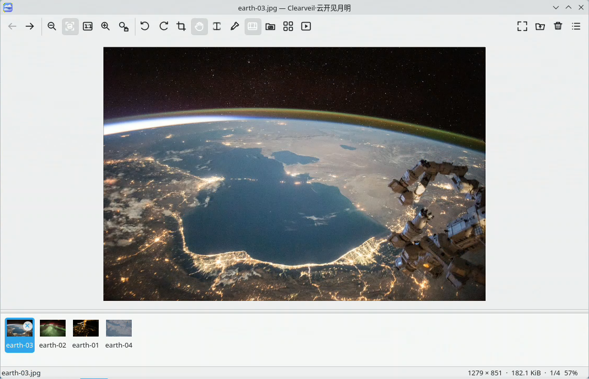
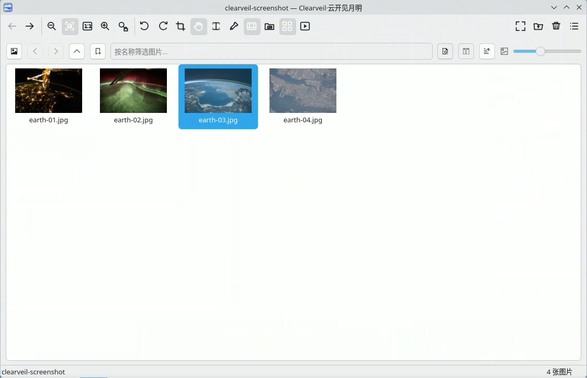

# Clearveil / 云开见月明

[](https://github.com/daringwalker/clearveil/actions/workflows/ci.yml)
[](https://github.com/daringwalker/clearveil/actions/workflows/codeql.yml)
[](LICENSE)

[English](README.en.md) · [用户文档](docs/README.md) ·
[开发路线](docs/roadmap.md) · [参与贡献](CONTRIBUTING.md)

Clearveil（中文显示名：云开见月明）是一款面向 Linux 桌面的开源图片查看器。它强调单窗口、画布优先
和直接的浏览体验：多次打开图片会复用同一进程，并维护用户明确打开的图片列表；
需要时也可以切换到当前文件夹浏览。

项目以快速、直接、可配置的日常图片浏览体验为设计目标，并保持独立的代码、品牌和视觉资产。

## 项目背景

Clearveil 是维护者依据本人使用习惯和兴趣开发的个人项目，主要希望解决 Linux 上缺少
符合这些习惯、简单易用的看图软件这一问题。项目的需求、产品方向、交互取舍、测试和
验收由维护者决定，全部程序代码均由 AI 工具生成或修改。

## 隐私、安全与免责声明

维护者不会有意在 Clearveil 中加入用户信息收集、遥测、跟踪或后门代码。软件仍可能
存在未知缺陷、安全问题或与特定环境不兼容的情况，不保证完全无错误、不中断或适用于
任何特定用途。

任何人均可依照 GPL-3.0-or-later 许可证免费使用、研究、修改和再分发本项目的源码及
编译产物。在适用法律允许的最大范围内，使用者应自行判断并承担运行、安装、修改或
分发本软件的风险；维护者不对由此造成的直接或间接损失及其他后果承担责任。完整许可
和无担保条款以 [LICENSE](LICENSE) 为准。

> Clearveil 目前处于早期测试阶段。基本查看流程已经可用，但公开发布、发行版打包和
> 不同桌面环境下的兼容性仍在完善。

## 界面截图





截图使用全新的默认配置在 KDE Plasma/Wayland 下实机采集。示例图片来自 NASA
Image and Video Library，具体图片编号、来源链接和使用说明见
[文档资源说明](docs/assets/README.md)；NASA 不为 Clearveil 提供背书。

## 主要能力

- 单实例、多文件打开列表和当前文件夹两种缩略图来源；
- 异步解码、相邻图片预读、有界内存缓存和 libvips 大图管线；
- 适应窗口、原始尺寸、连续缩放、旋转、翻转和全屏查看；
- GIF/WebP/APNG 动画以及 TIFF/ICO 多帧浏览；
- EXIF/IPTC/XMP 元数据、直方图和取色器；
- 按需 OCR、字符级文字框、鼠标拖选、双击选词和复制；
- 裁剪、调整尺寸、亮度/对比度/Gamma、另存为和常用文件操作；
- 可调整的工具栏、缩略图栏、信息面板和中英文界面；
- KDE/GNOME、Wayland/X11、深色/浅色主题支持。

## 构建

Clearveil 需要 C++20、CMake 3.24+、Qt 6.6+、libvips，完整元数据支持需要 Exiv2。

```bash
cmake -S . -B build -G Ninja \
  -DCMAKE_BUILD_TYPE=RelWithDebInfo \
  -DBUILD_TESTING=ON
cmake --build build
ctest --test-dir build --output-on-failure
./build/clearveil [图片路径...]
```

各发行版依赖包、可选编解码插件和安装方法见
[构建说明](docs/development/building.md) 与
[格式支持](docs/user/supported-formats.md)。

首个公开版本采用 `v0.2.0-beta.1` 预发布标签。GitHub Release 提供经过 CI 验证的源码包、
Arch Linux 包、DEB、RPM、AppImage、SHA-256 和带真实校验和的 PKGBUILD；完整发布步骤见
[GitHub 发布流程](docs/development/releasing.md)。

性能基准默认不参与普通构建，需要时显式启用：

```bash
cmake -S . -B build-bench -G Ninja \
  -DCMAKE_BUILD_TYPE=Release \
  -DBUILD_TESTING=OFF \
  -DCLEARVEIL_BUILD_BENCHMARKS=ON
cmake --build build-bench
```

## 文档

- [开始使用](docs/user/getting-started.md)
- [浏览图片](docs/user/browsing.md)
- [界面与布局](docs/user/customization.md)
- [工程架构](docs/development/architecture.md)
- [测试与验收](docs/development/testing.md)
- [产品原则](docs/design/product-principles.md)

## 参与项目

提交补丁前请阅读 [CONTRIBUTING.md](CONTRIBUTING.md)。缺陷报告应包含桌面环境、
显示协议、Clearveil/Qt 版本、图片格式及可复现步骤。安全问题请按
[SECURITY.md](SECURITY.md) 私下报告。

## 名称与许可

- 产品英文名：Clearveil
- 中文显示名：云开见月明
- 仓库、可执行文件和包名：`clearveil`

源代码以 [GPL-3.0-or-later](LICENSE) 发布，版权约定见
[COPYRIGHT.md](COPYRIGHT.md)。
